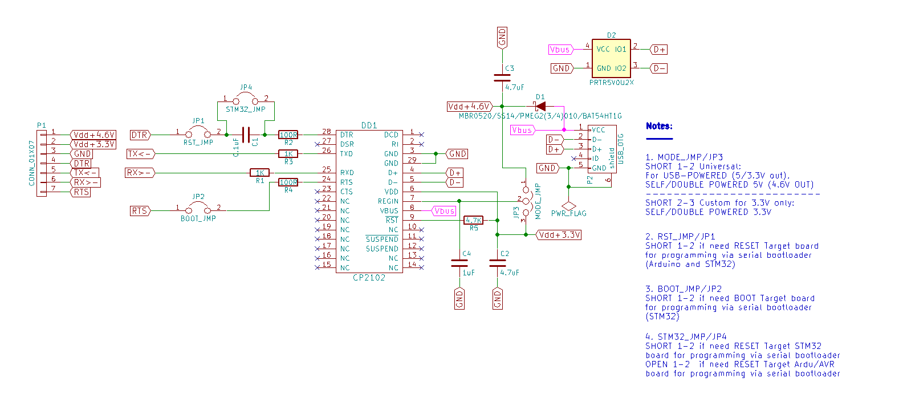
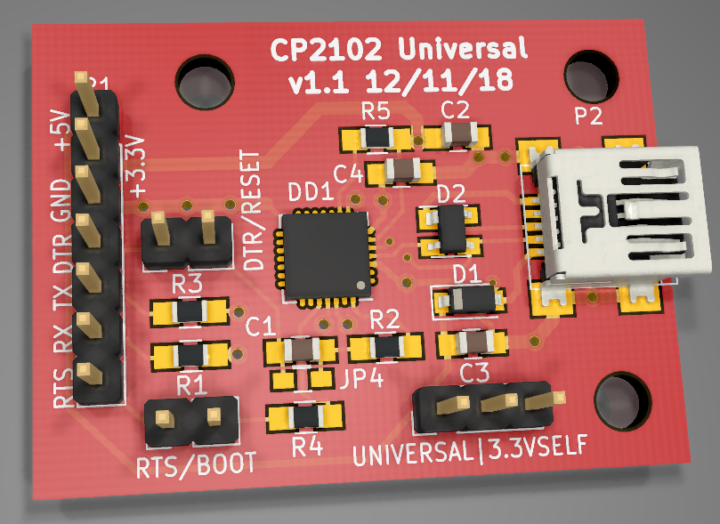

# Universal CP2102 USB-COM dongle

With Self/External/Double power mode,

USB lines suppression,

and DTR/RTS for Serial Bootloader (Arduino/AVR, LPCxxxx, STM32)

#### Schematic:

#### This is my own custom board looks like:

## Author
* **Ibragimov Maksim aka maxxir**
20/03/2019
