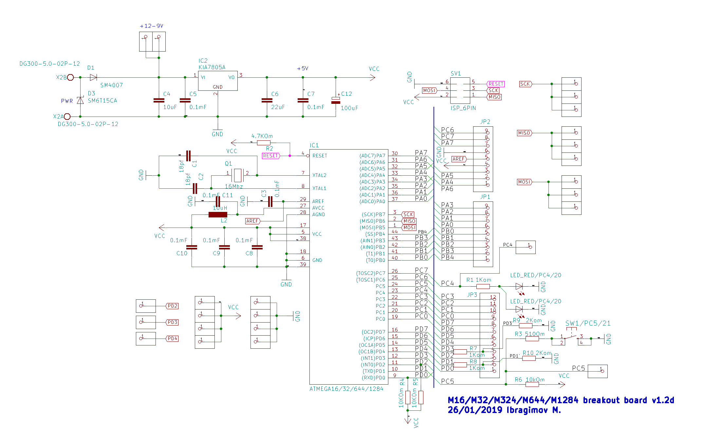
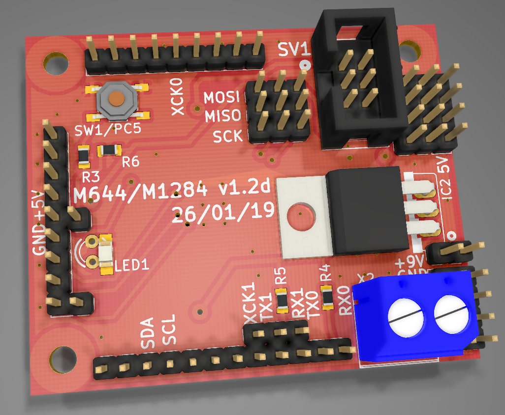

# AtMega 8535/16/32/324/644/1284 generic board

Compatible with Arduino Sanguino/Mightycore

#### Schematic:

#### This is my own custom board looks like:

## Author
* **Ibragimov Maksim aka maxxir**
08/04/2019
