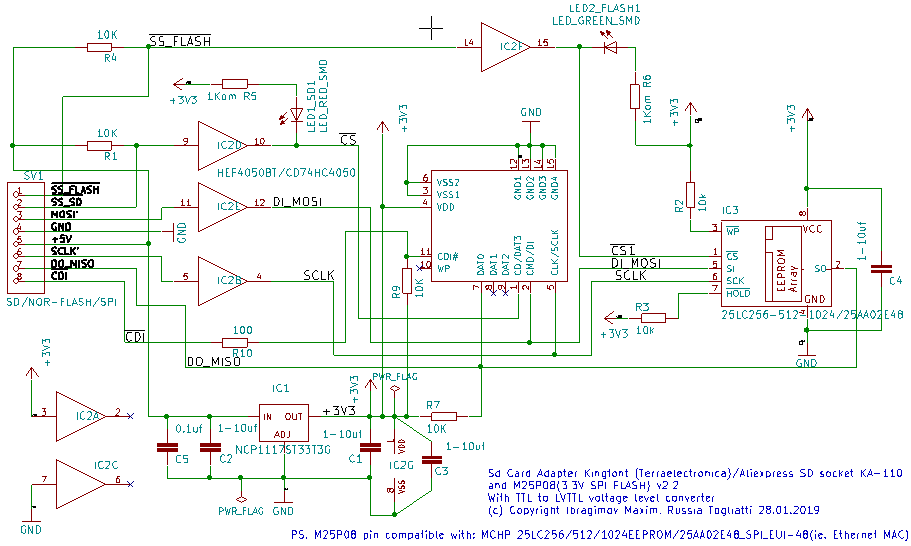

# SD Card and SPI FLASH reader for 5V TTL MCU

### Briefly about the features of the scheme:
* For 5V tolerance used HEF4050BT/CD74HC4050(preferable) Hex Non-Inverting Buffers IC.
* Additional CDI pin. This is the Card Detect pin. It shorts to ground when a card is inserted. 
* SPI FLASH compatible IC: M25P08/25LC256-512-1024/25AA02E48(Microchip OUI MAC GEN)
* Tested and used with [M644_breakout_v1.2d](https://github.com/maxxir/KiCad_maxxir/tree/master/KiCad_M644_breakout_v1.2d)
* Can be connected to any **5V-tolerante Arduino, AVR MEGA, PIC16/18, STM8 etc..**

#### Schematic:

#### This is my own custom board looks like:

## Author
* **Ibragimov Maksim aka maxxir**
22/04/2019
